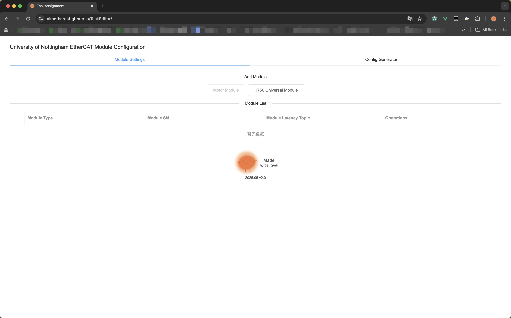
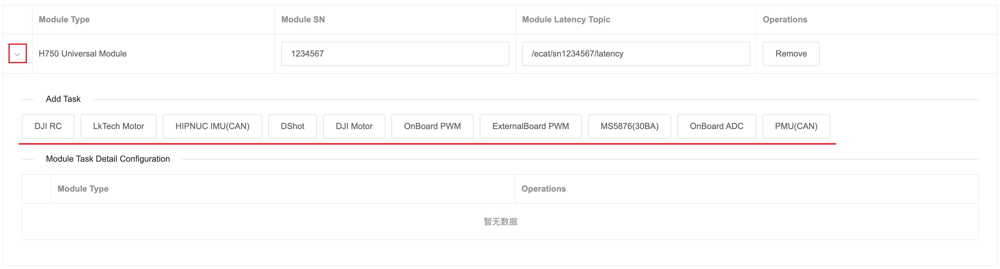
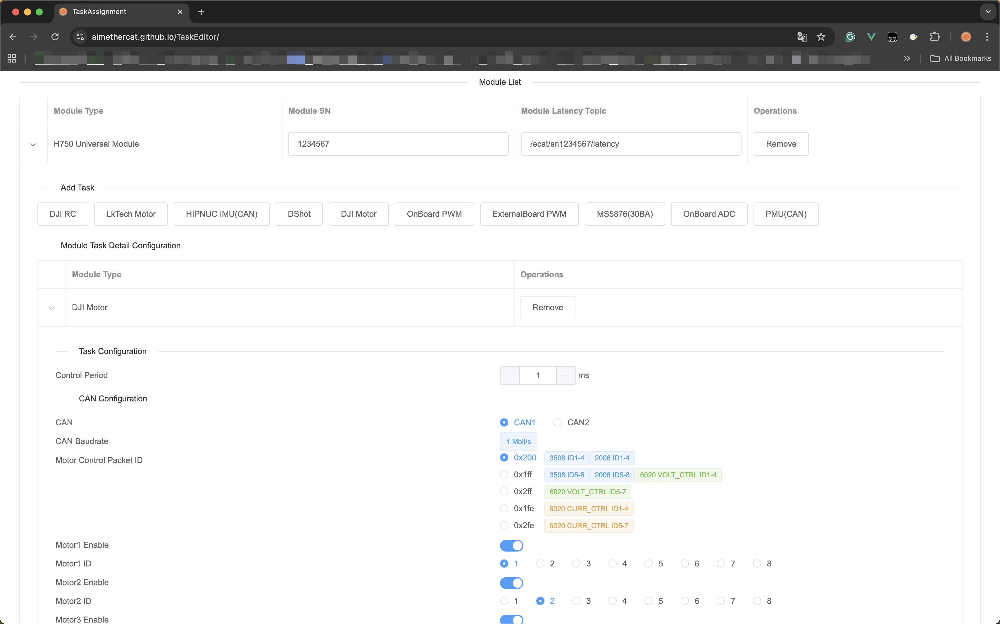
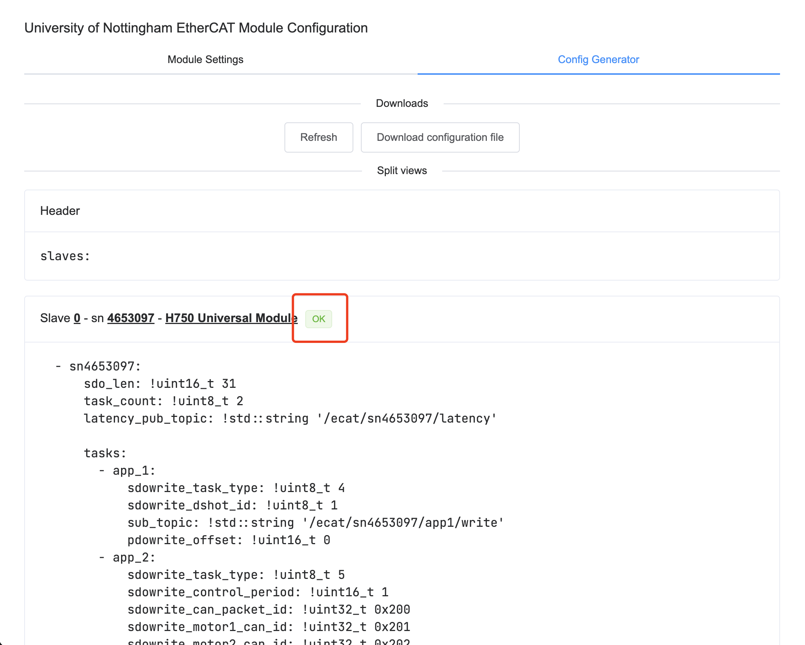
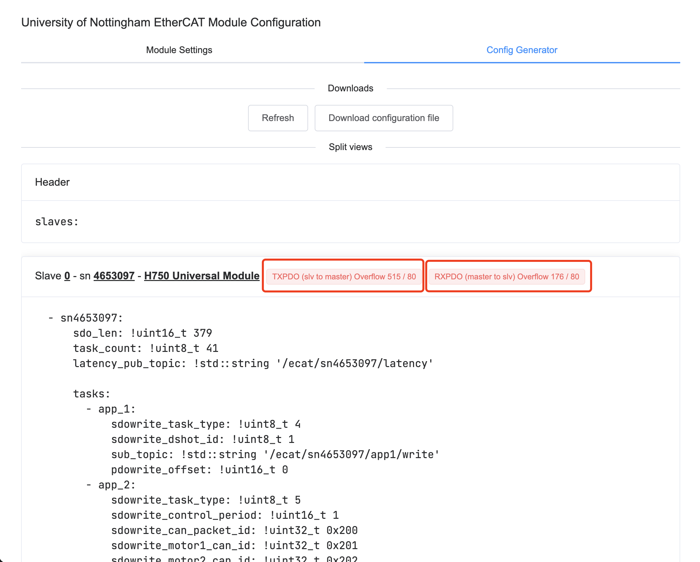
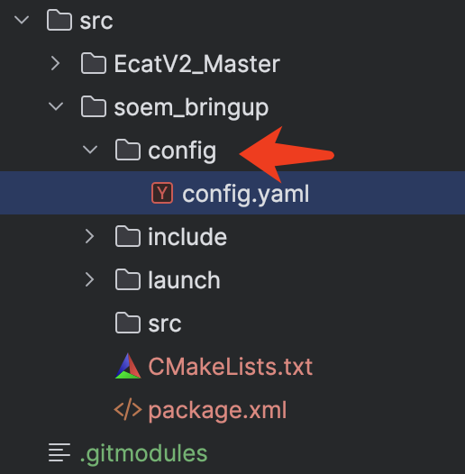

## EtherCAT Advanced Application Tutorial

### Visit the Online Configuration file generator

In most situations, if your device is connected to the Internet, you can
visit [here](https://aimethercat.github.io/TaskEditor) to use the online version of the configuration generator.

### Add Module

Typically, we make one type of **MCU** to be one type of **module**, so please add your corresponding module models.
This can be done by simply clicking the button with the name of your module on it.

Modules available now:

* H750 Universal Module

### Basic configuration

#### Serial Number

Input the SN of your board into the ``Module SN`` input box. You may get this number from the last tutorial about the
first run test.

Usually, it should be a 7-digit number.

#### Module Latency Topic

This could be auto-generated by default. Feel free to change it in the input box if you want to modify it.

This may be auto-updated after any changes in the SN input box, so if you changed SN and want to change your latency
topic, you may need to re-input it.

### Add Task

Click the arrow on the left side of the rows to see the list of all available tasks.

Click on the button with the task name you want to add, and then you can see it in the table. Similarly, you can click
the arrow on the left side of the rows to show more details and configurations for this task.

These tasks are currently available, each with an introduction of hardware preparation, configuration items, and related
ROS2 message type(s):

#### Tested tasks :)

They're tested by various test cases, and should be working fine.

* RCs
    * [DJI RC](task-info/dji-rc.md)
    * [SBUS RC](task-info/sbus-rc.md)

* Sensors
    * [HIPNUC IMU (CAN)](task-info/hipnuc-imu-can.md)

* Actuators
    * [DSHOT600](task-info/dshot.md)
    * [DJI Motor](task-info/dji-motor.md)
    * [DM Motor](task-info/dm-motor.md)
    * [LkTech Motor](task-info/lk-motor.md)
    * [Onboard PWM](task-info/onboard-pwm.md)

#### Untested tasks :(

They're probably not working or are not working properly.

Testing is in progress and will be updated.

* Sensors:
    * [~~MS5837 (30BA)~~ **UNTESTED](task-info/ms5837-30ba.md)
    * [~~Onboard ADC~~ **UNTESTED](task-info/onboard-adc.md)
    * [~~PMU (CAN)~~ **UNTESTED](task-info/pmu-can.md)
    * [SUPER CAP (CAN) **UNTESTED](task-info/super-cap.md)

* Actuators:
    * [~~External PWM~~ **UNTESTED](task-info/external-pwm.md)

### Download Configuration File

When you have added all the tasks you want, on the ``Config Generator`` page, you should see an overview of the
configuration file, with the configuration of each module displayed separately.

You may notice that there is a tag beside the module name.

Since the packet size used by the EtherCAT module to communicate with the master is fixed, the number of tasks that can
be added is also limited. Please remove some tasks if this tag shows any PDO that has an overflow.

If you think all configurations are good enough, click the download button, and you may now download a configuration
file named ``config.yaml``.

### Upload Your Configuration File

When your configuration file is ready, put it into the ``config`` folder of your **bringup package**. If you want
multiple configuration files, feel free to rename them.

If you have renamed this configuration, don't forget to change it in your ``bringup.launch.py`` file.

Finally, go back to the root folder of your workspace, run the command ``colcon build`` to make all your changes
effective.

### Done

You can now launch your application with your customized configuration file if everything works fine.

You should be able to see all topics related to your configured tasks, including publishers and subscribers.

If you want to send a command to any task, publish the corresponding message type into the corresponding topic.

### Example

~~If needed, you can refer to the example tutorial about creating an application that could control a DJI motor in speed
mode.~~ (To be updated)