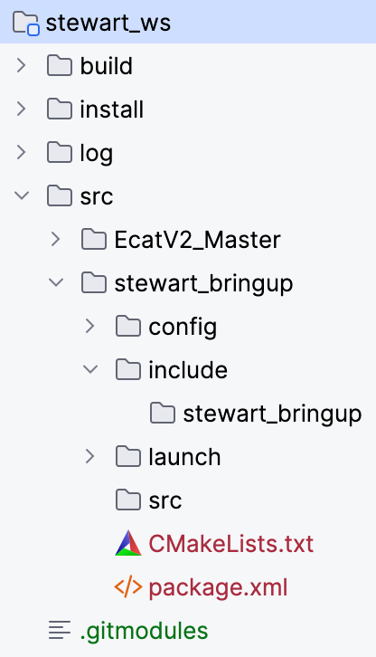
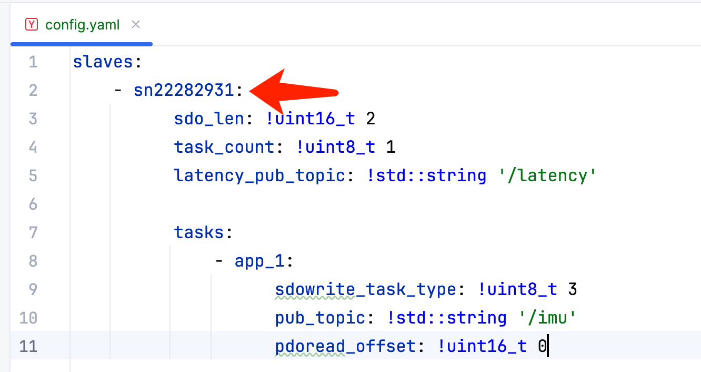

## EtherCAT First Run Tutorial

### Create Bringup Package

After finishing tutorial 1 about environment setup, go into the ``src`` folder, use the following command to create an bringup package: ``ros2 pkg create --build-type ament_cmake soem_bringup``

Then there should be a folder named ``soem_bringup`` in the ``src`` folder.

Create folders ``config`` and ``launch``

Modify the ``CMakeLists.txt`` file inside the ``soem_bringup``  folder. Insert the following code at line 13

```cmake
install(DIRECTORY
        launch
        config
        DESTINATION share/${PROJECT_NAME}/
)
```

At the end of this step, your workspace folder structure will be like this.



### Config File

This is an example configuration file, you can use this file for a first-run test. Create ``config.yaml`` file in the ``config`` folder and paste this content into this file.

```yaml
slaves:
  - sn2228293:
      sdo_len: !uint16_t 2
      task_count: !uint8_t 1
      latency_pub_topic: !std::string '/latency'

      tasks:
        - app_1:
            sdowrite_task_type: !uint8_t 3
            pub_topic: !std::string '/imu'
            pdoread_offset: !uint16_t 0
```

### Launch File

This is an example launch file, you can use this file for a first-run test. Create ``bringup.launch.py`` file in the ``launch`` folder and paste this content into this file.

```python
from launch import LaunchDescription
from launch_ros.actions import Node
import os
from ament_index_python.packages import get_package_share_directory

def generate_launch_description():
    config_file = os.path.join(
        get_package_share_directory('soem_bringup'),
        'config',
        'config.yaml'
    )

    return LaunchDescription([
        Node(
            package='soem_wrapper',
            executable='soem_backend',
            name='soem_backend',
            parameters=[{
                'interface': "enp2s0",
                'rt_cpu': 0,
                'non_rt_cpus': "1,2,3,4,5,6",
                'config_file': config_file
            }],
            output='screen'
        )
    ])
```

Modify the following parameters on lines 19-21 to match your environment settings

* interface: network interface that connects to the IN interface **of the slave module**
* rt_cpu: your isolated CPU ID (X in the last tutorial), index starting from 0
* non_rt_cpus: the rest of the CPU IDs that are not isolated (Y in the last tutorial), index starting from 0

### Do First-run test

Now use ``colcon build`` to build your project.

After building, use the command ``sudo su root`` to switch to the root user. This project could only run under the root user.

> **Note:** We recommend using a non-root user to run the build command. So you can open two terminal windows, one for building and one for executing.

Then use command ``source install/setup.bash`` to source the workspace, use ``ros2 launch soem_bringup bringup.launch.py`` to run the launch file.

If there are no other problems, your node will start and then exit due to a key_not_found error, because you haven't updated the SN of the slave module you're really connected to.

The output will be like this

```bash
$ ros2 launch stewart_bringup bringup.launch.py 

[INFO] [launch]: All log files can be found below /root/.ros/log/2025-07-28-20-45-21-674987-txy-Ultra155H-17558
[INFO] [launch]: Default logging verbosity is set to INFO
[INFO] [soem_backend-1]: process started with pid [17561]
[soem_backend-1] [INFO] [1753706721.874234516] [soem_node]: Using interface: enp2s0
[soem_backend-1] [INFO] [1753706721.875927263] [soem_node]: Using rt-cpu: 6
[soem_backend-1] [INFO] [1753706721.876024126] [soem_node]: Using non_rt_cpus: 0-5,7-15
[soem_backend-1] [INFO] [1753706721.876095632] [soem_node]: Using config_file: /home/txy/stewart_ws/install/stewart_bringup/share/stewart_bringup/config/config.yaml
[soem_backend-1] [INFO] [1753706721.876799285] [EthercatNode_DATA]: YAML insert type uint16_t key sn22282931_sdo_len value 2
[soem_backend-1] [INFO] [1753706721.876835512] [EthercatNode_DATA]: YAML insert type uint8_t key sn22282931_task_count value 1
[soem_backend-1] [INFO] [1753706721.876860046] [EthercatNode_DATA]: YAML insert type std::string key sn22282931_latency_pub_topic value /latency
[soem_backend-1] [INFO] [1753706721.876886628] [EthercatNode_DATA]: YAML insert type uint8_t key sn22282931_app_1_sdowrite_task_type value 3
[soem_backend-1] [INFO] [1753706721.876905339] [EthercatNode_DATA]: YAML insert type std::string key sn22282931_app_1_pub_topic value /imu
[soem_backend-1] [INFO] [1753706721.876924158] [EthercatNode_DATA]: YAML insert type uint16_t key sn22282931_app_1_pdoread_offset value 0
[soem_backend-1] [INFO] [1753706721.876951019] [EthercatNode_WRAPPER]: Registered new module, eepid=1, name=FlightModule, m2slen=16, s2mlen=40
[soem_backend-1] [INFO] [1753706721.876970472] [EthercatNode_WRAPPER]: Registered new module, eepid=2, name=MotorModule, m2slen=56, s2mlen=80
[soem_backend-1] [INFO] [1753706721.876981494] [EthercatNode_WRAPPER]: Registered new module, eepid=3, name=H750UniversalModule, m2slen=80, s2mlen=80
[soem_backend-1] [INFO] [1753706721.876993438] [EthercatNode_WRAPPER]: Registered new app, id=1, name=DJIRC
[soem_backend-1] [INFO] [1753706721.877021902] [EthercatNode_WRAPPER]: Registered new app, id=3, name=HIPNUC_IMU
[soem_backend-1] [INFO] [1753706721.877033709] [EthercatNode_WRAPPER]: Registered new app, id=5, name=DJI_MOTOR
[soem_backend-1] [INFO] [1753706721.877043050] [EthercatNode_WRAPPER]: Registered new app, id=4, name=DSHOT
[soem_backend-1] [INFO] [1753706721.877052110] [EthercatNode_WRAPPER]: Registered new app, id=6, name=VANILLA_PWM
[soem_backend-1] [INFO] [1753706721.877060684] [EthercatNode_WRAPPER]: Registered new app, id=7, name=EXTERNAL_PWM
[soem_backend-1] [INFO] [1753706721.877069168] [EthercatNode_WRAPPER]: Registered new app, id=8, name=MS5876_30BA
[soem_backend-1] [INFO] [1753706721.877077865] [EthercatNode_WRAPPER]: Registered new app, id=2, name=LK_MOTOR
[soem_backend-1] [INFO] [1753706721.877086244] [EthercatNode_WRAPPER]: Registered new app, id=9, name=ADC
[soem_backend-1] [INFO] [1753706721.877094991] [EthercatNode_WRAPPER]: Registered new app, id=10, name=CAN_PMU
[soem_backend-1] [INFO] [1753706721.888347508] [soem_node]: ec_init on enp2s0 succeeded.
[soem_backend-1] [INFO] [1753706722.033287831] [soem_node]: 1 slaves found
[soem_backend-1] [INFO] [1753706722.035283996] [soem_node]: all slaves backed to init, restarting mapping
[soem_backend-1] [INFO] [1753706722.180291177] [soem_node]: detected 1 slaves
[soem_backend-1] [INFO] [1753706722.185297328] [EthercatNode_CFG]: Found slave id=1, sn=2228293, eepid=3, type=H750UniversalModule
[soem_backend-1] terminate called after throwing an instance of 'std::runtime_error'
[soem_backend-1]   what():  get Key not found: sn2228293_sdo_len
```

Now, find line like ``[soem_backend-1] [INFO] [1753706722.185297328] [EthercatNode_CFG]: Found slave id=1, sn=2228293, eepid=3, type=H750UniversalModule`` in your output, this will indicate the slave SN you actually connected.

After you get the real SN, update it into the config.yaml file.



Run ``colcon build`` command to update your config file.

### Done

After finishing all steps above, run the command ``ros2 launch soem_bringup bringup.launch.py`` , the soem_wrapper node should now be running correctly. The output will be like this, especially contained line ``[soem_backend-1] [INFO] [1753707019.749195776] [EthercatNode_DATA]: slave id 1 confirmed ready``

```bash
$ ros2 launch stewart_bringup bringup.launch.py 
[INFO] [launch]: All log files can be found below /root/.ros/log/2025-07-28-20-50-18-907786-txy-Ultra155H-17835
[INFO] [launch]: Default logging verbosity is set to INFO
[INFO] [soem_backend-1]: process started with pid [17882]
[soem_backend-1] [INFO] [1753707019.161520036] [soem_node]: Using interface: enp2s0
[soem_backend-1] [INFO] [1753707019.163212979] [soem_node]: Using rt-cpu: 6
[soem_backend-1] [INFO] [1753707019.163379404] [soem_node]: Using non_rt_cpus: 0-5,7-15
[soem_backend-1] [INFO] [1753707019.163453034] [soem_node]: Using config_file: /home/txy/stewart_ws/install/stewart_bringup/share/stewart_bringup/config/config.yaml
[soem_backend-1] [INFO] [1753707019.164103724] [EthercatNode_DATA]: YAML insert type uint16_t key sn2228293_sdo_len value 2
[soem_backend-1] [INFO] [1753707019.164139140] [EthercatNode_DATA]: YAML insert type uint8_t key sn2228293_task_count value 1
[soem_backend-1] [INFO] [1753707019.164163374] [EthercatNode_DATA]: YAML insert type std::string key sn2228293_latency_pub_topic value /latency
[soem_backend-1] [INFO] [1753707019.164191142] [EthercatNode_DATA]: YAML insert type uint8_t key sn2228293_app_1_sdowrite_task_type value 3
[soem_backend-1] [INFO] [1753707019.164210465] [EthercatNode_DATA]: YAML insert type std::string key sn2228293_app_1_pub_topic value /imu
[soem_backend-1] [INFO] [1753707019.164229910] [EthercatNode_DATA]: YAML insert type uint16_t key sn2228293_app_1_pdoread_offset value 0
[soem_backend-1] [INFO] [1753707019.164270159] [EthercatNode_WRAPPER]: Registered new module, eepid=1, name=FlightModule, m2slen=16, s2mlen=40
[soem_backend-1] [INFO] [1753707019.164293854] [EthercatNode_WRAPPER]: Registered new module, eepid=2, name=MotorModule, m2slen=56, s2mlen=80
[soem_backend-1] [INFO] [1753707019.164305463] [EthercatNode_WRAPPER]: Registered new module, eepid=3, name=H750UniversalModule, m2slen=80, s2mlen=80
[soem_backend-1] [INFO] [1753707019.164317653] [EthercatNode_WRAPPER]: Registered new app, id=1, name=DJIRC
[soem_backend-1] [INFO] [1753707019.164335174] [EthercatNode_WRAPPER]: Registered new app, id=3, name=HIPNUC_IMU
[soem_backend-1] [INFO] [1753707019.164358656] [EthercatNode_WRAPPER]: Registered new app, id=5, name=DJI_MOTOR
[soem_backend-1] [INFO] [1753707019.164368896] [EthercatNode_WRAPPER]: Registered new app, id=4, name=DSHOT
[soem_backend-1] [INFO] [1753707019.164378921] [EthercatNode_WRAPPER]: Registered new app, id=6, name=VANILLA_PWM
[soem_backend-1] [INFO] [1753707019.164388235] [EthercatNode_WRAPPER]: Registered new app, id=7, name=EXTERNAL_PWM
[soem_backend-1] [INFO] [1753707019.164396663] [EthercatNode_WRAPPER]: Registered new app, id=8, name=MS5876_30BA
[soem_backend-1] [INFO] [1753707019.164405572] [EthercatNode_WRAPPER]: Registered new app, id=2, name=LK_MOTOR
[soem_backend-1] [INFO] [1753707019.164414034] [EthercatNode_WRAPPER]: Registered new app, id=9, name=ADC
[soem_backend-1] [INFO] [1753707019.164422505] [EthercatNode_WRAPPER]: Registered new app, id=10, name=CAN_PMU
[soem_backend-1] [INFO] [1753707019.179323514] [soem_node]: ec_init on enp2s0 succeeded.
[soem_backend-1] [INFO] [1753707019.323281713] [soem_node]: 1 slaves found
[soem_backend-1] [INFO] [1753707019.324313050] [soem_node]: all slaves backed to init, restarting mapping
[soem_backend-1] [INFO] [1753707019.465272967] [soem_node]: detected 1 slaves
[soem_backend-1] [INFO] [1753707019.469277072] [EthercatNode_CFG]: Found slave id=1, sn=2228293, eepid=3, type=H750UniversalModule
[soem_backend-1] [INFO] [1753707019.473281586] [EthercatNode_CFG]: SDO configured for slave id=1, sn=2228293, eepid=3, type=H750UniversalModule, sdolen=2
[soem_backend-1] [INFO] [1753707019.519488089] [EthercatNode_WRAPPER]: Publisher created key=sn2228293_latency_pub_inst
[soem_backend-1] [INFO] [1753707019.521671712] [EthercatNode_WRAPPER]: Publisher created key=sn2228293_app_1_pub_inst
[soem_backend-1] [INFO] [1753707019.521985849] [soem_node]: Slaves mapped, state to SAFE_OP.
[soem_backend-1] [INFO] [1753707019.523270297] [soem_node]: All slaves reached SAFE_OP, state to OP
[soem_backend-1] [INFO] [1753707019.526265901] [soem_node]: Operational state reached for all slaves.
[soem_backend-1] [INFO] [1753707019.526349546] [EthercatNode_CFG]: Initialization succeeded
[soem_backend-1] [INFO] [1753707019.527458462] [EthercatNode_SYS]: Thread priority set to 49 with SCHED_FIFO
[soem_backend-1] [INFO] [1753707019.590488756] [EthercatNode_SYS]: Move 79 cpuhp/6 to cpu 0-5,7-15
[soem_backend-1] [INFO] [1753707019.603414825] [EthercatNode_SYS]: Move 80 idle_inject/6 to cpu 0-5,7-15
[soem_backend-1] [INFO] [1753707019.614992755] [EthercatNode_SYS]: Move 81 irq_work/6 to cpu 0-5,7-15
[soem_backend-1] [INFO] [1753707019.627083974] [EthercatNode_SYS]: Move 82 migration/6 to cpu 0-5,7-15
[soem_backend-1] [INFO] [1753707019.639046929] [EthercatNode_SYS]: Move 83 rcuc/6 to cpu 0-5,7-15
[soem_backend-1] [INFO] [1753707019.649481084] [EthercatNode_SYS]: Move 84 ktimers/6 to cpu 0-5,7-15
[soem_backend-1] [INFO] [1753707019.660536493] [EthercatNode_SYS]: Move 85 ksoftirqd/6 to cpu 0-5,7-15
[soem_backend-1] [INFO] [1753707019.670411214] [EthercatNode_SYS]: Move 86 kworker/6:0-events to cpu 0-5,7-15
[soem_backend-1] [INFO] [1753707019.680409058] [EthercatNode_SYS]: Move 87 kworker/6:0H-events_highpri to cpu 0-5,7-15
[soem_backend-1] [INFO] [1753707019.690543462] [EthercatNode_SYS]: Move 212 backlog_napi/6 to cpu 0-5,7-15
[soem_backend-1] [INFO] [1753707019.700374407] [EthercatNode_SYS]: Move 255 kworker/6:1-events to cpu 0-5,7-15
[soem_backend-1] [INFO] [1753707019.710456417] [EthercatNode_SYS]: Keep 1370 irq/162-enp2s0-TxRx-0 at cpu 6
[soem_backend-1] [INFO] [1753707019.710474346] [EthercatNode_SYS]: Keep 1371 irq/163-enp2s0-TxRx-1 at cpu 6
[soem_backend-1] [INFO] [1753707019.710479072] [EthercatNode_SYS]: Keep 1372 irq/164-enp2s0-TxRx-2 at cpu 6
[soem_backend-1] [INFO] [1753707019.710482655] [EthercatNode_SYS]: Keep 1373 irq/165-enp2s0-TxRx-3 at cpu 6
[soem_backend-1] [INFO] [1753707019.710638350] [EthercatNode_SYS]: Move 4956 kworker/6:1H to cpu 0-5,7-15
[soem_backend-1] [INFO] [1753707019.721703154] [EthercatNode_SYS]: Keep 17882 soem_backend at cpu 6
[soem_backend-1] [INFO] [1753707019.721721034] [EthercatNode_SYS]: Move 17910 sh to cpu 0-5,7-15
[soem_backend-1] [INFO] [1753707019.732816628] [EthercatNode_SYS]: Move 17911 ps to cpu 0-5,7-15
[soem_backend-1] [INFO] [1753707019.743802362] [EthercatNode_SYS]: Bind irq 161           0          0          0          0          0          0          0          0          0          0          1          0          0          0          0          0  IR-PCI-MSIX-0000:02:00.0    0-edge      enp2s0 to cpu 6 successfully
[soem_backend-1] [INFO] [1753707019.743880907] [EthercatNode_SYS]: Bind irq 162           0          0          0          0          0          0    2623982          0          0          0          0        503          0          0          0          0  IR-PCI-MSIX-0000:02:00.0    1-edge      enp2s0-TxRx-0 to cpu 6 successfully
[soem_backend-1] [INFO] [1753707019.743916644] [EthercatNode_SYS]: Bind irq 163           0          0          0          0          0          0       6505          0          0          0          0          0        122          0          0          0  IR-PCI-MSIX-0000:02:00.0    2-edge      enp2s0-TxRx-1 to cpu 6 successfully
[soem_backend-1] [INFO] [1753707019.743950662] [EthercatNode_SYS]: Bind irq 164           0          0          0          0          0          0       6816          0          0          0          0          0          0        131          0          0  IR-PCI-MSIX-0000:02:00.0    3-edge      enp2s0-TxRx-2 to cpu 6 successfully
[soem_backend-1] [INFO] [1753707019.743983365] [EthercatNode_SYS]: Bind irq 165           0          0          0          0          0          0    2623441          0          0          0          0          0          0          0        479          0  IR-PCI-MSIX-0000:02:00.0    4-edge      enp2s0-TxRx-3 to cpu 6 successfully
[soem_backend-1] [WARN] [1753707019.744149979] [EthercatNode_SYS]: NIC enp2s0 rx_coalesce_usecs update failed
[soem_backend-1] [WARN] [1753707019.744157165] [EthercatNode_SYS]: NIC enp2s0 tx_coalesce_usecs update failed
[soem_backend-1] [WARN] [1753707019.744161704] [EthercatNode_SYS]: NIC enp2s0 rx_max_coalesced_frames update failed
[soem_backend-1] [WARN] [1753707019.744166027] [EthercatNode_SYS]: NIC enp2s0 tx_max_coalesced_frames update failed
[soem_backend-1] [INFO] [1753707019.744175441] [EthercatNode_SYS]: NIC enp2s0 low-latency params setup done
[soem_backend-1] [INFO] [1753707019.744185172] [EthercatNode_DATA]: slave id 1 sending sdo idx 1 / 2, content= 1, slavestatus=1, masterstatus=2
[soem_backend-1] [INFO] [1753707019.744252861] [EthercatNode_DATA]: slave id 1 sending sdo idx 1 / 2, content= 1, slavestatus=1, masterstatus=2
[soem_backend-1] [INFO] [1753707019.744561220] [EthercatNode_DATA]: slave id 1 sending sdo idx 1 / 2, content= 1, slavestatus=1, masterstatus=2
[soem_backend-1] [INFO] [1753707019.744781317] [EthercatNode_DATA]: slave id 1 sending sdo idx 2 / 2, content= 3, slavestatus=1, masterstatus=2
[soem_backend-1] [INFO] [1753707019.745049160] [EthercatNode_DATA]: slave id 1 sending sdo idx 2 / 2, content= 3, slavestatus=1, masterstatus=2
[soem_backend-1] [INFO] [1753707019.745291358] [EthercatNode_DATA]: slave id 1 sending sdo idx 2 / 2, content= 3, slavestatus=1, masterstatus=2
[soem_backend-1] [INFO] [1753707019.745547957] [EthercatNode_DATA]: slave id 1 sdo all sent
[soem_backend-1] [WARN] [1753707019.745624870] [EthercatNode_WRAPPER]: App name=HIPNUC_IMU don't have init_value method but got called
[soem_backend-1] [INFO] [1753707019.745653656] [EthercatNode_DATA]: slave id 1 sdo confirmed received
[soem_backend-1] [INFO] [1753707019.749195776] [EthercatNode_DATA]: slave id 1 confirmed ready
```

After finishing these steps, you may see lines like ``slave id n confirmed ready``, which confirms that your system and
slave module are working correctly. Note, if you connected more than one slave, you should see this messages multiple
times each with different slave id, in order to make sure that all slaves are ready.

If everything works fine, You can now subscribe to the topic ``/latency``, which will show the travel latency between
your computer and the slave module in milliseconds. This value should be less than 1.0 in most situations. If it is
greater than 1.0, please check your system CPU isolation settings.

Please then refer to the next tutorial about how to use our soem_wrapper application.