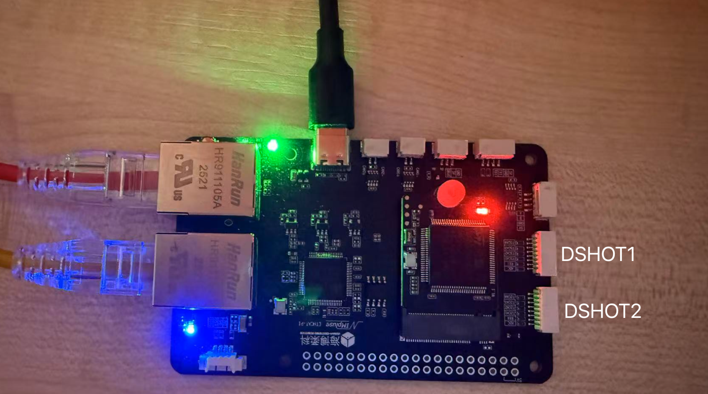

## EtherCAT Task Introduction

### DSHOT

#### Hardware preparation

Connect your ESC to any ``DSHOT`` port (also TIM port) of your EtherCAT module.

Currently, it works in DSHOT600 mode.

#### Configuration items

* TIM
    * This refers to the ID of the DSHOT port.
    * 
* Initial Value
    * This means the initial DSHOT value EtherCAT will send before receiving any command

You can change the subscriber topic name by inputting a new name in the ``Motor Command Subscriber Topic Name`` input
box.

#### Related ROS2 Message Types

```c
/* Message type: custom_msgs/msg/WriteDSHOT */

uint16 channel1 // 0 = disarmed, [1, 47] = reserved for commands, [48, 2047] = thrust value
uint16 channel2 // 0 = disarmed, [1, 47] = reserved for commands, [48, 2047] = thrust value
uint16 channel3 // 0 = disarmed, [1, 47] = reserved for commands, [48, 2047] = thrust value
uint16 channel4 // 0 = disarmed, [1, 47] = reserved for commands, [48, 2047] = thrust value
```