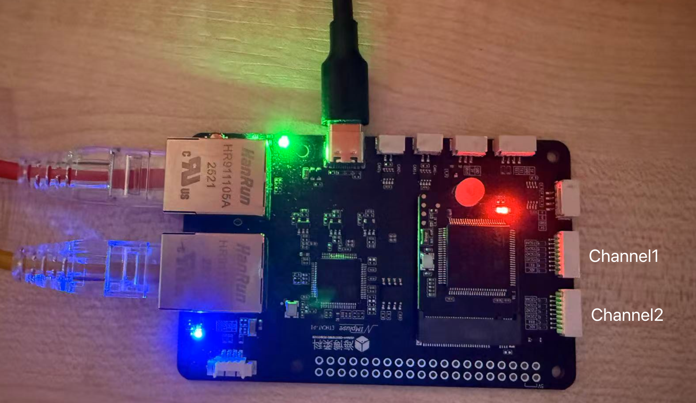

## EtherCAT Task Introduction

### Onboard ADC

#### Hardware preparation

Connect your voltage source to any ``ADC`` port (also DSHOT/TIM port) of your EtherCAT module.

#### Configuration items

* Coefficient for channel <n>
    * The ADC input range is 0-3.3V. The EtherCAT module will multiply the sampled voltage by this coefficient and feed
      it into the built-in filter. The output value is the multiplied and filtered value. For example, an ammeter with a
      range of 0-60A has a corresponding ADC voltage of 0-3.3V. In this case, the coefficient is 60/3.3 = 18.18, meaning
      that every 1V represents 18.18A.
    * 

You can change the publisher topic name by inputting a new name in the ``Onboard ADC Publisher Topic Name`` input box.

#### Related ROS2 Message Types

```c
/* Message type: custom_msgs/msg/ReadADC */

std_msgs/Header header

float32 channel1
float32 channel2
```