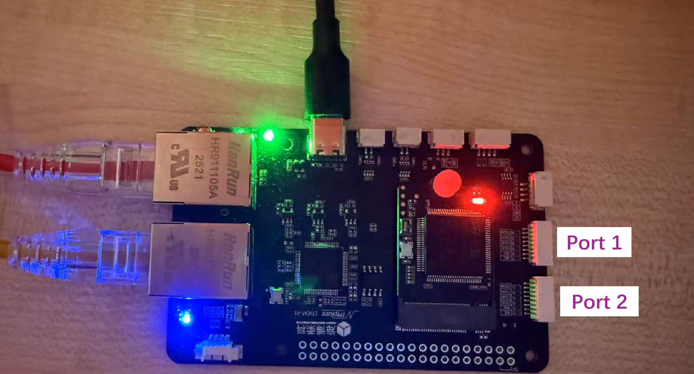

## EtherCAT Task Introduction

### Onboard PWM

#### Hardware preparation

Connect your ESC to any ``TIM`` port (also DSHOT port) of your EtherCAT module.

#### Configuration items

* TIM
    * This refers to the ID of Tim Port.
    * 
* Period (us)
    * This is the period of the generated PWM signal.
* Initial Value (us)
    * This means the initial high pulse width of the PWM signal EtherCAT will send before receiving any command.

You can change the subscriber topic name by inputting a new name in the ``Motor Command Subscriber Topic Name`` input
box.

#### Related ROS2 Message Types

```c
/* Message type: custom_msgs/msg/WriteVanillaPWM */

uint16 channel1 // us
uint16 channel2 // us
uint16 channel3 // us
uint16 channel4 // us
```